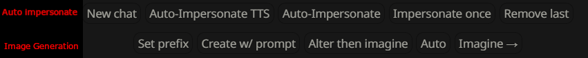

Auto impersonate and image generation quick replies

Seperate buttons for TTS and no TTS

Image gen works with auto impersonate. Click auto and select "Execute on AI message" to generate an image for each message

Requires SillyTavern-LALib https://github.com/LenAnderson/SillyTavern-LALib

